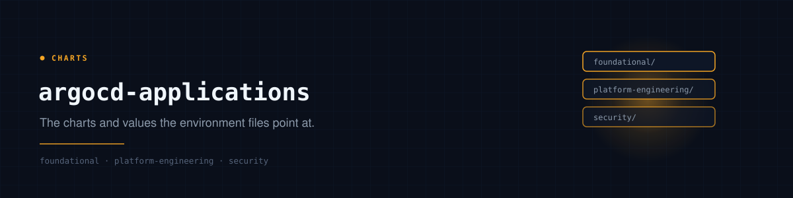

# argocd-applications

The charts and values files that
[argocd-core](https://github.com/polarpoint-io/argocd-core)'s environment values
point at.

Nothing here declares an Application. A deployment is described in
`<env>-aoa-values.yaml`; this repo holds the two things such a declaration can
reference — a chart we author, and a values file for an upstream chart.

## Layout

Organised by **concern, not by ArgoCD project**. The project is a property of
the declaration in argocd-core, so a directory here is free to say what the
thing actually is.

```
argocd-applications/
├── foundational/          the per-cluster baseline: everything, everywhere
│   ├── common/              storage, secrets plumbing
│   ├── security/            certificates, runtime detection
│   └── observability/       collection and shipping
├── platform-engineering/  the tools the platform is built from
│   ├── iac/                 crossplane providers and their configuration
│   ├── holmesgpt-runbook-mcp/
│   ├── kargo-projects/
│   └── postiz/
└── security/              workloads whose job is security
    └── ciso-assistant-postgres/
```

The `<env>/` level is the **environment**, not the cluster. That is what lets a
foundational chart shared by three clusters live in one directory, and what gives
prod somewhere to differ from non-prod without a second chart.

```
foundational/security/falco/non-prod/values.yaml
platform-engineering/iac/grafana-provider/non-prod/values.yaml
```

## The two kinds of directory

**A values file** for an upstream chart. The declaration in argocd-core names the
chart and points `valuesPath` here, which makes the Application multi-source —
the chart, plus this repo as a `$values` reference.

```yaml
# argocd-core
- name: falco
  url: https://falcosecurity.github.io/charts
  chart: falco
  targetRevision: 9.1.0
  valuesPath: foundational/security/falco/non-prod/values.yaml
```

**A chart** we author, referenced by `path:`. Used where there is no upstream
chart, or where the thing being deployed is a handful of custom resources.

```yaml
# argocd-core
- name: kargo-projects-non-prod
  url: git@github.com:polarpoint-io/argocd-applications.git
  path: platform-engineering/kargo-projects/non-prod
```

## What does not live here

**Manifests.** ExternalSecrets, Certificates and TLS proxies are values against
[helm-library-manifests](https://github.com/polarpoint-io/helm-library-manifests),
carried on the application that needs them as an `extraSources` entry. There is
no `*-manifests` directory and no `*-manifests` Application.

**Per-cluster values.** A values file fetched from git gets no substitution — the
ApplicationSet generator only expands its own template. Anything that varies by
cluster stays inline in argocd-core, where `{{cluster}}` and `{{short}}` work.

**Secrets.** Every credential comes from External Secrets Operator. The most a
file here does is name the key to read.

## Adding something

1. Put the chart or values file under the right concern and env folder.
2. Declare it in `argocd-core/<env>-aoa-values.yaml` — `applications:` for one
   cluster, `applicationSets:` for the baseline on all of them.
3. Render before pushing:

```sh
helm template aoa ../argocd-app-of-apps -f ../argocd-core/non-prod-aoa-values.yaml
```

## The stack

| Repo | Owns |
|---|---|
| [`argocd-core`](https://github.com/polarpoint-io/argocd-core) | ArgoCD bootstrap, and every deployment declaration |
| [`argocd-app-of-apps`](https://github.com/polarpoint-io/argocd-app-of-apps) | The chart that turns those declarations into Applications |
| [`argocd-applications`](https://github.com/polarpoint-io/argocd-applications) | Charts and values files the declarations point at |
| [`helm-library-manifests`](https://github.com/polarpoint-io/helm-library-manifests) | The manifests every application repeats |
